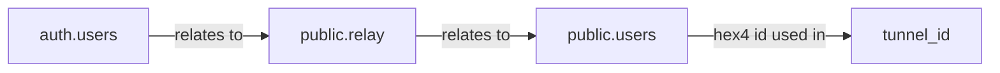

# TunnelBroker Frontend Requirements

## Technology Stack
- Node.js v22.14.0
- Next.js 15.2.4 with Approuter
- Tailwind CSS v4.1
- Supabase Auth v2 (with supabase/ssr and supabase.js)

## Setup Instructions

### Node.js Installation
```bash
# Download and install nvm
curl -o- https://raw.githubusercontent.com/nvm-sh/nvm/v0.40.2/install.sh | bash

# Source nvm
\. "$HOME/.nvm/nvm.sh"

# Install Node.js v22
nvm install 22

# Verify installation
node -v  # Should output v22.14.0
nvm current  # Should output v22.14.0
npm -v  # Should output 10.9.2
```

### Project Setup
```bash
npx create-next-app@latest
```

## Authentication Requirements

### Available Auth Methods over supabase auth v2
- GitHub OAuth
- Email/Password

### Registration Process
User must provide:
- Email
- Password (for email registration)
- Full Name
- Nickname (optional)

### User Metadata Structure
```json
{
  "sub": "06e938f4-d5d5-43fa-b0aa-4d3c498a15d0",
  "email": "heralds.71burgess@icloud.com",
  "nickname": "kiantrieb",
  "full_name": "Dąbrowski",
  "email_verified": true,
  "phone_verified": false
}
```

## Page Requirements

### Public Landing Page
- Service description
- Free service disclaimer
- Security restrictions information
- Abuse policy warning
- Dark/Light mode toggle

### User Dashboard
#### Header
- Display nickname (fallback to full_name if nickname is empty)
- Display user_id (hex4) from public.users table
- Dark/Light mode toggle

#### Main Features
1. Tunnel Management
   - List of active tunnels
   - Tunnel creation (limited to 2 per user)
   - Client IP modification
   - Tunnel deletion
   - Client configuration view
   - Warning when reaching tunnel limit

2. Account Management
   - Password change (email users only)
   - Email address modification
   - GitHub account linking/unlinking
   - Account deletion option

## Database Relations


## UI/UX Requirements
- English language only
- Dark/Light theme support
- Responsive design
- Clear warning messages for:
  - Tunnel limits
  - Abuse policy
  - Account actions

## Security Considerations
- SSR implementation with supabase/ssr
- Protected routes
- Rate limiting
- Input validation
- Secure session management

## Error Handling
- Clear error messages
- Graceful fallbacks
- Session expiration handling
- Network error recovery

[Previous content remains the same...]

## API Integration

### Backend API Configuration
- Base URL: `127.0.0.1:8080`
- Required Header: `X-API-Key` (from `/etc/tunnelbroker/config.yaml`)
- All endpoints require authentication

### API Endpoints

#### 1. Tunnel Creation
```http
POST /api/v1/tunnels
Header: X-API-Key: {api_key}
{
    "type": "sit|gre",
    "user_id": "hex4",
    "client_ipv4": "x.x.x.x"
}
```

#### 2. Update Client IP
```http
PATCH /api/v1/tunnels/{tunnel_id}/ip
Header: X-API-Key: {api_key}
{
    "client_ipv4": "x.x.x.x"
}
```

#### 3. Delete Tunnel
```http
DELETE /api/v1/tunnels/{tunnel_id}
Header: X-API-Key: {api_key}
```

#### 4. List Tunnels
```http
GET /api/v1/tunnels?user_id={user_id}
Header: X-API-Key: {api_key}
```

#### 5. Get Tunnel Details
```http
GET /api/v1/tunnels/{tunnel_id}
Header: X-API-Key: {api_key}
```

## Database Schema

### Supabase Tables

#### 1. auth.users (Managed by Supabase)
- Default Supabase auth table
- Contains user authentication data
- Stores raw_user_meta_data (nickname, full_name)

#### 2. public.relay
```sql
CREATE TABLE public.relay (
    id uuid DEFAULT gen_random_uuid() NOT NULL,
    auth_user_id uuid NOT NULL,
    generated_hex4 text NOT NULL,
    created_at timestamp with time zone DEFAULT now() NOT NULL
);
```

#### 3. public.users
```sql
CREATE TABLE public.users (
    id text NOT NULL,
    created_tunnels integer DEFAULT 0,
    active_tunnels integer DEFAULT 0,
    created_at timestamp with time zone DEFAULT now() NOT NULL
);
```

#### 4. public.tunnels
```sql
CREATE TABLE public.tunnels (
    id text NOT NULL,
    user_id text NOT NULL,
    type text NOT NULL,
    status text NOT NULL,
    server_ipv4 text NOT NULL,
    client_ipv4 text NOT NULL,
    endpoint_local text NOT NULL,
    endpoint_remote text NOT NULL,
    delegated_prefix_1 text NOT NULL,
    delegated_prefix_2 text NOT NULL,
    created_at timestamp with time zone DEFAULT now() NOT NULL,
    delegated_prefix_3 text,
    CONSTRAINT tunnels_status_check CHECK ((status = ANY (ARRAY['active'::text, 'suspended'::text]))),
    CONSTRAINT tunnels_type_check CHECK ((type = ANY (ARRAY['sit'::text, 'gre'::text])))
);
```

## Environment Configuration

### Supabase Configuration
Create `.env.local` in frontend directory:
```bash
SUPABASE_DB_HOST=db.dpljaohscrflilbhybkp.supabase.co
SUPABASE_DB_PORT=5432
SUPABASE_DB_USER=postgres
SUPABASE_DB_PASSWORD=Ditzu8-qirgyr-kagnax

# Backend API configuration
NEXT_PUBLIC_API_URL=http://127.0.0.1:8080
NEXT_PUBLIC_API_KEY=your-api-key-from-config
```

### Backend Configuration Location
- API Key: `/etc/tunnelbroker/config.yaml`
- Database Credentials: `/etc/tunnelbroker/.env`

## Frontend-Backend Integration

### Authentication Flow
1. User authenticates via Supabase Auth
2. On successful auth:
   - Check public.relay for user's hex4
   - If not exists, create new entry
   - Use hex4 for all tunnel operations

### Data Flow
1. Frontend -> Supabase
   - User authentication
   - User profile management
   - User metadata

2. Frontend -> Backend API
   - Tunnel CRUD operations
   - System configuration
   - All requests must include API key

### Error Handling
- Handle API errors (400, 401, 403, 500)
- Supabase connection issues
- Authentication state management
- Session recovery

### Security Considerations
- Store API key securely
- Implement rate limiting on frontend
- Validate all user inputs
- Handle session expiration
- Implement CORS properly

## Development Setup

### Required Environment Files
1. Frontend root (`/frontend/.env.local`):
```bash
NEXT_PUBLIC_SUPABASE_URL=from_supabase_dashboard
NEXT_PUBLIC_SUPABASE_ANON_KEY=from_supabase_dashboard
NEXT_PUBLIC_API_URL=http://127.0.0.1:8080
NEXT_PUBLIC_API_KEY=from_config_yaml
```

2. Backend configuration (reference only):
```yaml
# /etc/tunnelbroker/config.yaml
api:
  key: "your_api_key_here"
  listen: "127.0.0.1:8080"
```

### Development Commands
```bash
# Install dependencies
npm install

# Run development server
npm run dev

# Build production
npm run build

# Start production server
npm start
```